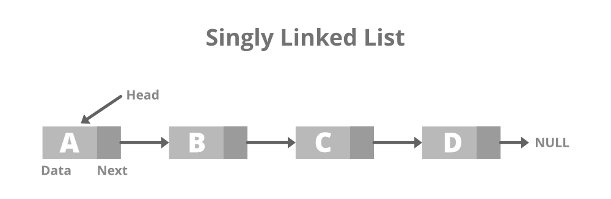

# Queue #

Queue Data Structure is a linear data structure that follows *FIFO* (First In First Out) 
Principle, so the first element inserted is the first to be popped out.

The most simple data structe is Queue struct, that's can be based in two way
	-Array Queue
	-Linked List

## Array Queue ##
	the array queue is not not used in practice as it is not efficient.
	The concept of an "Array Queue" is to create a struct that has values such 
	as "capacity," which defines its capacity, "front," which represents the 
	first element, and "rear," which is the index where the elements extend in the array.

	```
	struct Queue* createQueue(int capacity) {
    struct Queue* q = (struct Queue*)malloc(sizeof(struct Queue));
    q->capacity = capacity;
    q->front = 0;
    q->rear = -1;
    q->queue = (int*)malloc(q->capacity * sizeof(int));
    return q;
	}
	```

	The concept is to truly place it as a stack of values, where the last 
	element to be added is the first to be removed.

	Queue is Empty
 	20 <--  30 <--  40 <--  50 <-- 

	After two node deletions
 	40 <--  50 <-- 

	After one insertion
 	40 <--  50 <--  60 <-- 

## Linked List ##
	The concept is not to create a single segmentation in memory with the values we want,
	 but to create a connection between multiple structures of the same type arranged in 
	 memory. This connection is made by storing the address of the next element within 
	 the structure

	 head & tail = front & rear

	```
	// Node structure representing a single node in the linked
	// list
	typedef struct Node {
    int data;
    struct Node* next;
	} Node;

	// Function to create a new node
	Node* createNode(int new_data)
	{
    Node* new_node = (Node*)malloc(sizeof(Node));
    new_node->data = new_data;
    new_node->next = NULL;
    return new_node;
	}
	```

	It's as if we have an array of pointers for each data structure, but in a 
	non-linear manner in memory, unlike in the "Array Queue

	Types of Linked Lists:
	
	-Singly Linked List
	-Doubly Linked Lists
	-Circular Linked Lists

	**Singly Linked List**: In this type of linked list, every node stores the address
	or reference of the next node in the list and the last node has the next address 
	or reference as NULL. For example: 1->2->3->4->NULL

	

	**Doubly Linked Lists:** In a doubly linked list, each node has two pointers: 
	one pointing to the next node and one pointing to the previous node. This
	 bidirectional structure allows for efficient traversal in both directions.

	

	Circular Linked Lists: A circular linked list is a type of linked list in
	 which the first and the last nodes are also connected to each other to form
	a circle, there is no NULL at the end.

	

	## Stack Data Structure ##

	A stack is a linear data structure that follows the Last-In-First-Out (LIFO)
	principle, meaning that the last element added to the stack is the first one 
	to be removed.

	

	Types of Stack:

	-Fixed Size Stack: 
		Has a set size and can't change. Overflows if full, underflows if empty.

	-Dynamic Size Stack: 
		Grows or shrinks as needed. Uses a linked list to adjust size automatically.

	# Queue #

	A queue is a linear data structure that follows the First-In-First-Out (FIFO) 
	principle. In a queue, the first element added is the first one to be removed.

	Queue Operations:

	-Enqueue: Adds (or stores) an element to the end of the queue..
	-Dequeue: Removal of elements from the queue.
	-Peek or front: Acquires the data element available at the front node of the queue without deleting it.
	-rear: This operation returns the element at the rear end without removing it.
	-isFull: Validates if the queue is full.
	-isEmpty: Checks if the queue is empty.

LINKS

https://www.geeksforgeeks.org/introduction-to-linear-data-structures/
https://www.geeksforgeeks.org/introduction-to-queue-data-structure-and-algorithm-tutorials/
https://www.geeksforgeeks.org/queue-data-structure/